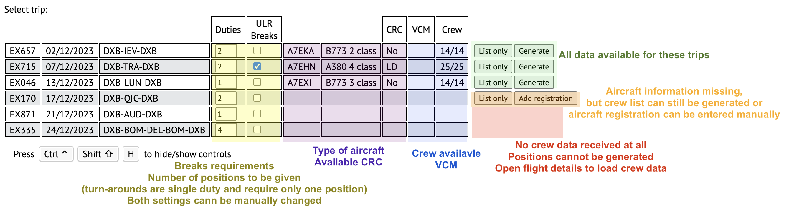
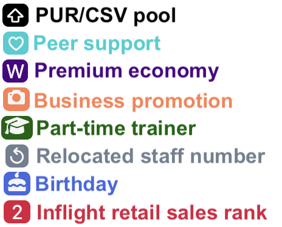
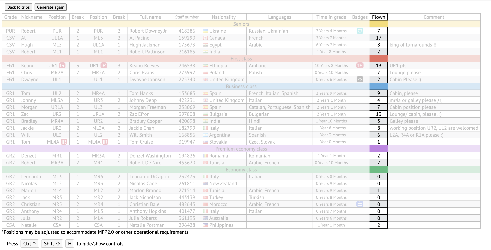
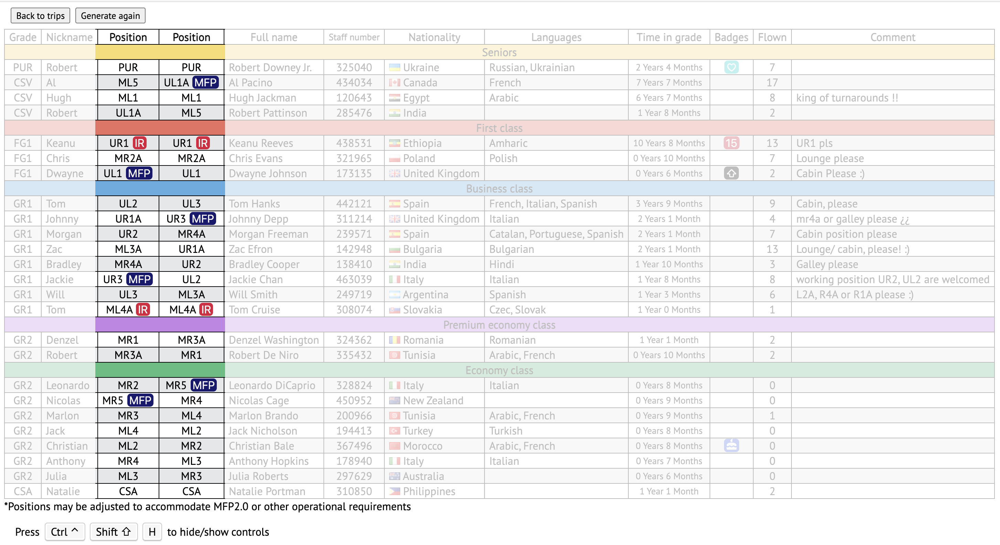
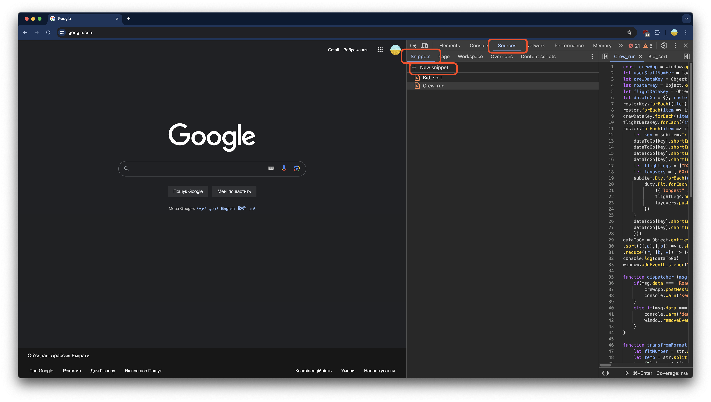
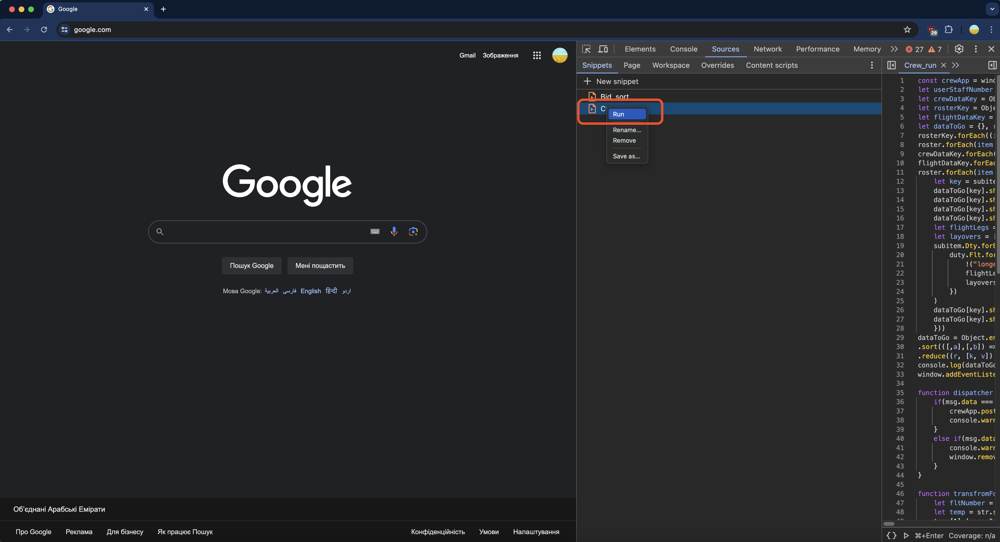
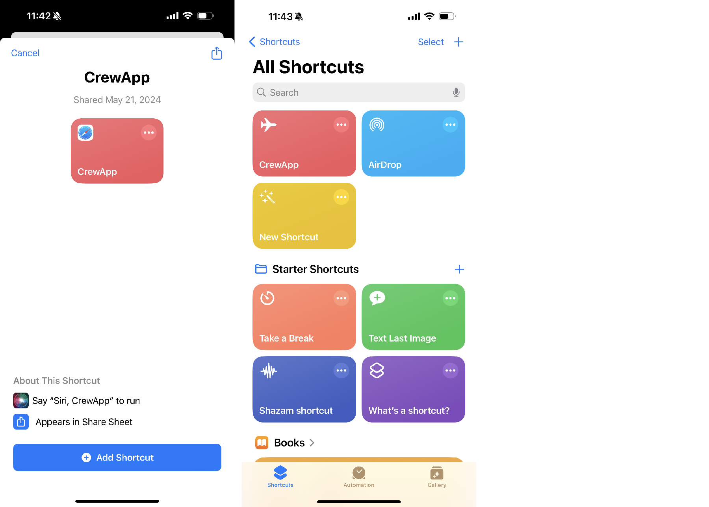
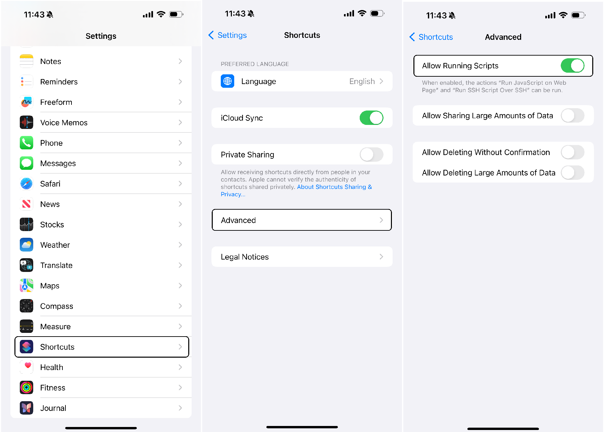
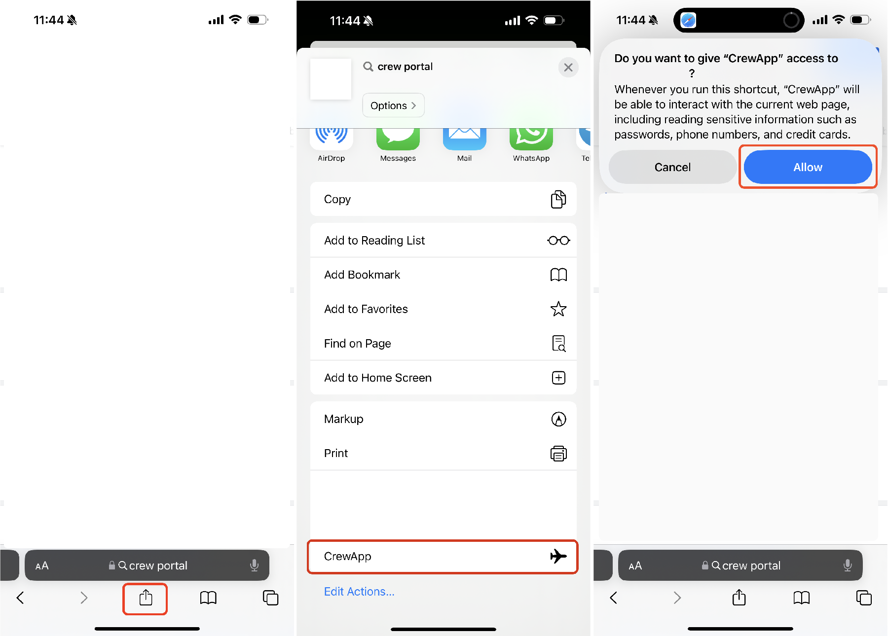
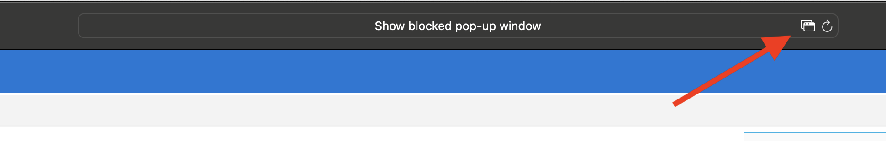

# Cabin crew positions

Allocating crew positions before the flight can be a challenging and time consuming task due to number of regulations and requirements involved in the process. It saved hours of time for me, when making pre-flight emails. I hope you will find it useful too.

Here is a quick look:

## Disclaimer

Just to remind you that most of information on crew portal is confidential and should not be shared with third parties. This project is purely for educational purposes. 

## Algorithm

__Data that influence__ position allocation:

* Galley operated by experienced crew member (company requires more than 3 month, but, for smoother operation, script will try allocate galley to crew with over 6 month experience in grade)
* In-flight retail should be operated by crew with highest sale rank. If no such crew is available, junior Gr1 will be selected. This design decision made based on experience: Gr1 will always have red pouch (Gr2 often reject inflight retail position using "no red pouch" excuse)
* Positions to be changed on different sectors
* Breaks allocated according to crew rest strategies.
* Minimum crew requirements. Positions UR1A, UL1A, UC1 should be always occupied. Script will handle VCMs automatically adjusting positions.

I want to consider giving cabin position to __crew with MFP__, but there is no access to such information on crew portal.

Works for any type of operation except cases, when data is incomplete/missing.

## Features
>
> [!TIP]
> Previous version can be found [here](https://github.com/nevtemu/crew-positions "Crew positions 2").

### New features in this version

* All information fetched automatically from portal (no need to copy-paste any data).
* Completely new algorithm for position allocation
* Breaks allocation complete overhaul. Now crew can have same break on both sectors, but first break on night flight is *good*, first break on day flight is *bad*. More importantly breaks are related to crew position now, so inflight retail  operators are not on same break, equal number of Gr2 from FWD and AFT galley (A380 Y class) on break, MFP (MR5, L5A) same break as CSV, galley operator on earlier breaks to prepare for next service etc.
* Added option to generate only list of crew (to give positions manually). This is especially useful in case algorithm fails for any reason: you will still be able to generate crew list and give positions manually.
* Advanced error handling. For example, more information provided in console regarding VCM etc.
* If aircraft registration not found or not available on the portal, added option to input in manually. Minimum requirement is crew data to generate table (without it entire script make no sense).
* Support for positions for W class
* Added key-bind for keyboard to show/hide GUI

#### GUI enhancements

* Added completely new trips pages where can see list of all duties, general flight information

* More badges supported (trainers, relocated ID, birthday etc.). Separate function checks for crew birthdays around flight dates.

* Added information about number of times flown to this destination.

* Crew comments now have limited number of symbols. Long comments trimmed to avoid stretching of this table cell. However, full comment is still available in tooltip of he cell.

* In position cells “(IR)” replaced with badge. Added button “+” to add MFP badge. Unfortunately MFP information is not available on the portal, so only can add manually after flight loaded on purser's table.

* New font [PT Sans](https://www.paratype.com/collections/pt/44157 "PT Sans")
* Now can completely hide GUI (to print only table)

## Limitations

* __Breaks can repeat__. On rare occasions crew can get same break on all sectors. This is conscious decision as getting 1st break on one flight is considered good and on another - bad. Also breaks are now linked to positions to ensure company regulations are met. In addition for certain types of operation crew rest strategies divide crew into unequal groups (for example, A380 MD-CRC LRV has one, four and three Gr1s on different break groups), so in certain scenarios breaks will repeat.
* __Cargo flights support__ has been completely removed. They are not rostered to crew any more. If you happened to get one, it still can be processed via “List only” option.
* __Script would not work__ if information fetched is incomplete or missing entirely. This is common on reserve, when many duties missing crew or aircraft data. Minimum requirement for script to work is to have crew information (registration, type of operation can be manually input). Also commonly known that script will fail if crew complement altered at higher grades: FG1 pulled out as GR2 and PUR pulled out as CSV etc. For this cases I suggest to use "List only" option.

## How to use?

#### For  Windows and   Chrome users:
1. In Google Chrome open DevTools: press F12 on the keyboard or Ctrl+Shift+I keys. Go to `Sources` tab, then to `Snippets`. Press `+ New snippet`. Copy `snippet.js` from folder `install/WinOS` of this project to your new snippet. This need to be done only once (next time script will be saved/available in snippets).

2. Now all you need to do is to open portal and then run this snippet (right click the snippet and select `Run`). 

>
> [!TIP]
> Previous version of installation guide including automatization with TamperMonkey is [here](./install/readme_old.md "Crew positions 2").

#### For  macOS/iOS and  Safari users:
Added support for macOS/iOS. It is implemented via  Shortcuts app. 
1. Intall [this shortcut](https://www.icloud.com/shortcuts/8ad2ce296e1e4c478b1831a3fd354741 "CrewApp Shortcut") on your device. In folder `install/MacOS` same shortcut available as downloadable file. 

2. Allow shortcuts to [run JavaScript](https://support.apple.com/en-ca/guide/shortcuts/apdb71a01d93/ios "Run JS  on browser tab") in [settings](https://support.apple.com/en-ca/guide/shortcuts/apdfeb05586f/7.0/ios/17.0 "Apple security settings") 

3. On crew portal click `Share` icon, find `CrewApp` shortcut and run it

>
> [!CAUTION]
> The app opens new tab in browser. Most browsers by default block pop-up windows. If app does not run, check that pop-up blocker is disabled.
> 

Enjoy!

>
> [!IMPORTANT]
> All snippets/shortcuts have url of the local host: you require to run local service on this port or host app online and change the url

If you need help setting it up, reach me out 😊. Or let me know your feedback, desired features.

## Changelog

List of changes / updates became too large, so I moved it into separate [file](./changelog.md "Changelog") .

## Known issues

* __Supy__. App will most probably identify that you have supy and alert you. However, from available data there is no reliable way to confirm that someone is supy: it is not always most junior crew (supy have their own grade in HR, but shown in Gr2 list with experience 2 months in rostering). I suggest to check via their roster or crew with pre-allocated position on KIS and then change their position manually.

* __Aircraft mismatch__. If you have 3 class crew and different aircraft (2 class aircraft one way, 3 class aircraft return). Even if move Fg1s to Y, still 2 class B773 has no CSV in J, so it is very confusing for algorithm. I'm planing to look into the issue, but for now suggest just to use "List only" feature and do what you like manually.

* __A350__. I'm waiting for more information on how the flight will be operated, registration and requirements.
