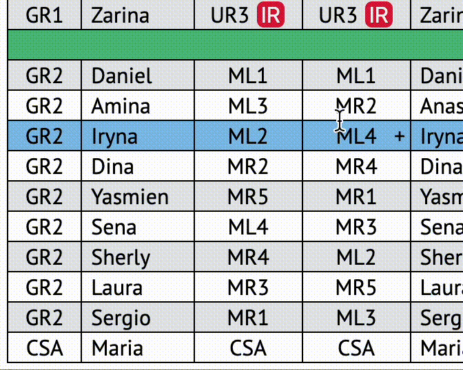

# Cabin crew positions

Allocating crew positions before the flight can be a challenging and time consuming task due to number of regulations and requirements involved in the process. It saved hours of time for me, when making pre-flight emails. I hope you will find it useful too.

Here is a quick look:

## Algorithm

__Data that influence__ position allocation:

* Galley operated by experienced crew member (company requires more than 3 month, but, for smoother operation, script will try allocate galley to crew with over 6 month experience in grade)
* In-flight retail should be operated by crew with highest sale rank. If no such crew is available, junior Gr1 will be selected. This design decision made based on experience: Gr1 will always have red pouch (Gr2 often reject inflight retail position using "no red pouch" excuse)
* Positions to be changed on different sectors
* Breaks allocated according to crew rest strategies.
* Minimum crew requirements. Positions UR1A, UL1A, UC1 should be always occupied. Script will handle VCMs automatically adjusting positions.

I want to consider giving cabin position to __crew with MFP__, but there is no access to such information on crew portal.

Works for any type of operation except cases, when data is incomplete/missing.

## Features
>
> [!TIP]
> Previous version can be found [here](https://github.com/nevtemu/crew-positions "Crew positions 2").

### New features in this version

* All information fetched automatically from portal (no need to copy-paste any data).
* Completely new algorithm for position allocation
* Breaks allocation complete overhaul. Now crew can have same break on both sectors, but first break on night flight is *good*, first break on day flight is *bad*. More importantly breaks are related to crew position now, so inflight retail  operators are not on same break, equal number of Gr2 from FWD and AFT galley (A380 Y class) on break, MFP (MR5, L5A) same break as CSV, galley operator on earlier breaks to prepare for next service etc.
* Added option to generate only list of crew (to give positions manually). This is especially useful in case algorithm fails for any reason: you will still be able to generate crew list and give positions manually.
* Advanced error handling. For example, more information provided in console regarding VCM etc.
* If aircraft registration not found or not available on the portal, added option to input in manually. Minimum requirement is crew data to generate table (without it entire script make no sense).
* Support for positions for W class
* Added key-bind for keyboard to show/hide GUI

#### GUI enhancements

* Added completely new trips pages where can see list of all duties, general flight information

* More badges supported (trainers, relocated ID, birthday etc.). Separate function checks for crew birthdays around flight dates.

* Added information about number of times flown to this destination.

* Crew comments now have limited number of symbols. Long comments trimmed to avoid stretching of this table cell. However, full comment is still available in tooltip of he cell.

* In position cells “(IR)” replaced with badge. Added button “+” to add MFP badge. Unfortunately MFP information is not available on the portal, so only can add manually after flight loaded on purser's table.

* New font [PT Sans](https://www.paratype.com/collections/pt/44157 "PT Sans")
* Now can completely hide GUI (to print only table)

## Limitations

* __Breaks can repeat__. On rare occasions crew can get same break on all sectors. This is conscious decision as getting 1st break on one flight is considered good and on another - bad. Also breaks are now linked to positions to ensure company regulations are met. In addition for certain types of operation crew rest strategies divide crew into unequal groups (for example, A380 MD-CRC LRV has one, four and three Gr1s on different break groups), so in certain scenarios breaks will repeat.
* __Cargo flights support__ has been completely removed. They are not rostered to crew any more. If you happened to get one, it still can be processed via “List only” option.
* __Script would not work__ if information fetched is incomplete or missing entirely. This is common on reserve, when many duties missing crew or aircraft data. Minimum requirement for script to work is to have crew information (registration, type of operation can be manually input).

## How to use?

This is the hardest part. Entire process can be automated to pressing key binding to start execution. That's it! However, due to cybersecurity, strict policies for data protections, I'm afraid to publish it online myself. But I will give you few options to choose.

There are two parts to get this done:

* The app need to be run on a server (local or web)
* Run script itself

### Server for the app

#### Option 1.1

The easiest way will be to host the app on any webhosting (paid or free). This way the app will be constantly running online (accessed from any computer). Advantage of this method: set up once and forever (no need to run the app every time). Downside: the data will be transferred to the web (can be potentially stolen or misused). For free hosting can use [BIZ](https://www.biz.nf "biz.nf") or choose any other.

#### Option 1.2

Run local server. This is more safe way as the app will be run on local host (your machine) and not available on the web, but it is more annoying since you will need to keep it running on your PC or run it every time you want to use the app. There are extensions like [Live server](https://chromewebstore.google.com/detail/live-server-web-extension/fiegdmejfepffgpnejdinekhfieaogmj "Live Server") or [Web server](https://chromewebstore.google.com/detail/web-server-for-chrome/ofhbbkphhbklhfoeikjpcbhemlocgigb "Web Server") for Google Chrome that allows to do this. There are other options as well. Unfortunately, app files cannot be open locally.
I personally run it directly from [VS Code](https://code.visualstudio.com "Visual Studio Code") with [Live server](https://marketplace.visualstudio.com/items?itemName=ritwickdey.LiveServer "Live Server") extension.

### Run the script

Here are also few options available.

#### Option 2.1

Manually run script from Google Chrome DevTools. In Google Chrome open DevTools: press F12 on the keyboard or Ctrl+Shift+I keys. Go to `Sources` tab, then to `Snippets`. Copy `snippet.js` from folder `Browser_snippets` of this project to `Snippets`. This need to be done only once (next time script will be saved/available in snippets). Now all you need to do is to open portal and then run this snippet (right click and select `Run`). If the app is running, you will see trip info page (it will open in new browser tab).

If running app on local host (live server like option 1.2), no changes required. If hosted app online, then need to update url in snippet to your app web address.

#### Option 2.2

To automate more, you can install extension for Google Chrome like [Tamper Monkey](https://chromewebstore.google.com/detail/tampermonkey/dhdgffkkebhmkfjojejmpbldmpobfkfo "Tamper Monkey") or `User Scripts`. Once installed, add new script (copy from file `tamperMonkey.js` from folder `Browser_snippets` of this project). It is important to add portal web address into empty header line.

When saved, it will look like this in your scripts list. It will automatically run on portal when launched (no need to open DevTools).

Now, when crew portal tab is active, you can just press key binding `Ctrl`+`Shift`+`G` (Go) to run the app. This option 2.2 in combination with option 1.1 are most automated way to use this app: set up only once and then run any time needed by just using key-binding on keyboard (without opening DevTools or running Live server). This is how it will look in the browser.

Enjoy!

If you need help setting it up, reach me out 😊. Or let me know your feedback, desired features.

## Changelog

20.12.2023
> Added sections for upgrade prices and retail targets information. 
> 

22.12.2023
> Added aircraft delivery date (in service since / age). Also VCM now has conditional formatting: red if negative.
> 
> Added settings to toggle on/off additional information.

16.03.2024
> Shortened aircraft delivery date.

> Project has grown large. Slitted into separate modules.

> Added settings to toggle on/off additional information.

> Added information for ramadan services.
> 

17.03.2024
> Added UL1A for B773 LRV. Lots of work: position, break and VCM changes.

> Added link to change comment on crew portal.
> 

> Added autocorrection of breaks, when positions changed manually.
> 

> Added highlight for duplicated positions.
> 

19.03.2024
> Moved DF position to UL3 and MFP to UR3 (Initially my thought were to align with A380 2 class where UR3 is DF, but it make more sense to keep MFP on same side as CSV for service, and even on 2 class it is changed by company now).
