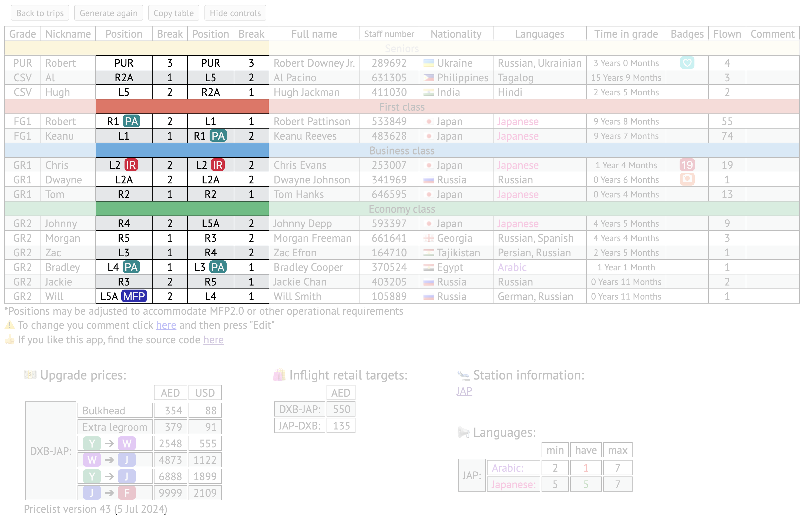

# Changelog

## 20.12.2023

Added sections for upgrade prices and retail targets information. 

---

## 22.12.2023

Added aircraft delivery date (in service since / age). Also VCM now has conditional formatting: red if negative.

Added settings to toggle on/off additional information.

---

## 16.03.2024

Shortened aircraft delivery date.

Project has grown large. Slitted into separate modules.

Added settings to toggle on/off additional information.

Added information for ramadan services.

---

## 17.03.2024

Added UL1A for B773 LRV. Lots of work: position, break and VCM changes.

Added link to change comment on crew portal.

Added autocorrection of breaks, when positions changed manually.

Added highlight for duplicated positions.

---

## 19.03.2024

Moved DF position to UL3 and MFP to UR3 (Initially my thought were to align with A380 2 class where UR3 is DF, but it make more sense to keep MFP on same side as CSV for service, and even on 2 class it is changed by company now).

---

## 09.04.2024

Moved most functions into separate modules.

Updated upgrade prices and retail targets.

Added links to station information.

Fixed bug in breaks autocorrection and repeat highlights related to unbreakable spaces.

---

## 24.04.2024

Added MR4A for A380-800 2 class (Serve better changes)

Station information link now opens in new tab

Added registration EPP. Registration EUE, EUH, EUJ, EUK, EUL retrofitted into 4 class.

Fixed bug in load_positions function

---

## 29.04.2024

Fixed bug in positions for B777-300 (missing R2)

Changed source for flag icons. Added flag for Kosovo (missing on company's portal)

Changed inflight retail positions: B772 to R1, A380 to UL3 (Serve better changes)

---

## 02.05.2024

Minor change to timeInGrade check: for rare scenario when crew rostered out of grade but operates in his current grade

Added temporary rule for J galley operator to be most senior crew and remain galley on all sectors

---

## 21.05.2024

Added macOS/iOS version via Shortcuts. Had to change all data files and settings into .js format (from .json) as Safari does not support [import assertions](https://caniuse.com/mdn-javascript_statements_import_import_assertions "Import assertion browser support"). 

---

## 25.05.2024

Added settings to the app: now you are able to turn on/off features. Settings are now renamed to default settings.

Moved more functions into separate modules.

Changed handler for destination experience: now for multisector trips destinations shown in list of experiences. Same destination experience is not repeated any more

Fixed bug in extra rules function: forgot to import error handler.

Added shortcut file for MacOS version.

---

## 03.06.2024

Added link to app's source code

Fixed bag in add_registration_manually function

Added option to allocate breaks on selected sectors only. Required for trips mixed of short sectors/ shuttles and long sectors. Tooltip for checkboxes now shows individual sector duration.

Changed styles for trips table: VCM moved to the end of row (seems more logical), shortened headers and removed "In service since" header, added bold borders between sections of the table, destinations do not show DXB any more, table headers styled like folder tabs, changed duty date format.

Small refactoring to snippet and generate_positions function. The app will require at least [this version](https://caniuse.com/mdn-api_structuredclone "Structured clone browser support") of browser.

Now your own settings will save into cookie and will be loaded automatically next time. You do not need to select settings every time.

Updated upgrade prices (added Bogota and Phnom Penh) and inflight retail targets (removed duplicates).

Added option to select W crew manually for 4 class flights. This feature requested by Ayman. This is arguable as current policy states: allocate W to “experienced” crew. However, I still implemented it, just to have more flexibility.

>
> [!CAUTION]
> This is major update affecting the script itself, so shortcut/script require re-install.

---

## 10.06.2024

Restriction to keep same galley operator in J related to new service was lifted as of 06.06. I removed temporary rules for US flights and for J galley operator. Now positions allocated randomly with rotation again.

Updated fleet: EUI is refitted to 4 class now even it is not updated in fleet chart on portal.

---

## 06.07.2024

Added Antananarivo, Edinburgh, Adelaide. Updated data (upgrade prices, DF targets). Added new data for language requirements for destinations.

MacOS shortcuts updated to new version (separate legs duration added)

---

## 16.07.2024

Added pricelist version and effective date. Always double check official company pricelist before processing upgrades in case any delayed updates.

Added highlight for Arabic and third languages. Added table with language requirements in additional info.

Moved app source code link to the bottom of the table.

Fixed a bug when loading settings from cookie file with default settings updated.

MFP button now changed to badge button (including: W, PA, MFP, IR). Badges in position cells are now clickable themselves and have options to change, replace or remove the badge.

Added automatic allocation of PAs.

Added button to copy table to clipboard if you want to paste it into email directly (not as separate file). Be mindful that appearance of the table will be affected by size of app's window where email will be open (some text may wrap onto next row and look not so pretty etc.)

Added button to hide GUI. I noticed increasing number of people using the app on iPad where key bind is not always available, so added button to hide controls. I decided to make them disappear completely (no button to show them again) as I trust you will use it only as last step before saving to file. Note: it is still possible to make controls reappear via key bind.

---

## 10.08.2024

Added effective dates for all additional information

Added support for B773 4 class aircraft. For A350 still waiting for more information. This incudes updates to: fleet, aircraft types, VCM rules, breaks, positions.

Updated upgrade pricelist.

Renamed "premium economy" to "premium". I think, it's a recent trend.

---

## 19.08.2024

Updated upgrade pricelist.

---

## 30.08.2024

Added package.json

Fixed bug in add_aircraft_registration manually in rare case when FlightData not received at all. create-trips does not required input any more as DataPool is now global variable.
Added guard to birthday_check for rare case when FlightData not received at all (flight dates are unknown).

Added guard for selectPA for case when no language speakers available.

Clicking on column header now hides the column. This feature is requested by Fady. You can now hide/remove certain information from crew.

---

## 18.09.2024

Moved changelog to separate file.

Added temporary rule for R5C position (additional Gr1 on B773). There is no crew rest strategy and it is unknown how company will handle VCM on those flights. It will make sense if L2A galley and R2 MFP will be on same break with CSV R2A (1st break), however, the rule is implemented in stages, so moving L2A to 1st break will affect all other flights (with 3 Gr1s). So temporary solution for now is to place R5C on 1st break and see when crew rest strategies get updated.

Reduced font size for effective date of additional information.

Added caution "When W crew manually selected the order of crew in table will be different from VR1!".

Fixed bug, when required language list was not updated after previous duty if this duty crashed with error.

---

## 12.10.2024

Fixed bug in B772 VCM rules.

Updated fleet (EQI retrofited to 4 class)

---

## 30.11.2024

Updated all fleet age. Fleet age header tab is now visible.

Updated upgrade prices.

Updates to fleet: many aircraft retrofitted to 4 class. One B773 retrofitted 2 class, but I kept it in 2 class group.

Updated breaks: changes to A380 2 class (addition of MR4A), B772 now ULR (with CSV in J) and non-ULR (with Gr1) handled separately. Entire breaks updated.

Fixed bug with fleet age: error handling if fleet age is not found.

Fixed bug in positions type selector in load_positions: in rare case for ULR B773 trips positions were treated non-ULR. This also affected required_crew_number and create_trips functions.

Fixed bug in additional_info: corrected upgrade prices selection for multisector journeys, filtering only unique sectors.

Fixed major bug: breaks were taken from wrong operation type.

Added support for B772 ULR and non-ULR trips: now handled separately. New VCM rules added.
