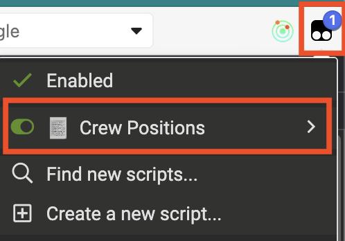

## How to use?

This is the hardest part. Entire process can be automated to pressing key binding to start execution. That's it! However, due to cybersecurity, strict policies for data protections, I'm afraid to publish it online myself. But I will give you few options to choose.

There are two parts to get this done:

* The app need to be run on a server (local or web)
* Run script itself

### Server for the app

#### Option 1.1

The easiest way will be to host the app on any webhosting (paid or free). This way the app will be constantly running online (accessed from any computer). Advantage of this method: set up once and forever (no need to run the app every time). Downside: the data will be transferred to the web (can be potentially stolen or misused). For free hosting can use [BIZ](https://www.biz.nf "biz.nf") or choose any other.

#### Option 1.2

Run local server. This is more safe way as the app will be run on local host (your machine) and not available on the web, but it is more annoying since you will need to keep it running on your PC or run it every time you want to use the app. There are extensions like [Live server](https://chromewebstore.google.com/detail/live-server-web-extension/fiegdmejfepffgpnejdinekhfieaogmj "Live Server") or [Web server](https://chromewebstore.google.com/detail/web-server-for-chrome/ofhbbkphhbklhfoeikjpcbhemlocgigb "Web Server") for Google Chrome that allows to do this. There are other options as well. Unfortunately, app files cannot be open locally.
I personally run it directly from [VS Code](https://code.visualstudio.com "Visual Studio Code") with [Live server](https://marketplace.visualstudio.com/items?itemName=ritwickdey.LiveServer "Live Server") extension.

### Run the script

Here are also few options available.

#### Option 2.1

Manually run script from Google Chrome DevTools. In Google Chrome open DevTools: press F12 on the keyboard or Ctrl+Shift+I keys. Go to `Sources` tab, then to `Snippets`. Press `+ New snippet`. Copy `snippet.js` from folder `Browser_snippets` of this project to your new snippet. This need to be done only once (next time script will be saved/available in snippets). Now all you need to do is to open portal and then run this snippet (right click and select `Run` or whatever you called your snippet). If the app is running, you will see trip info page (it will open in new browser tab).

If running app on local host (live server like option 1.2), no changes required. If hosted app online, then need to update url in snippet to your app web address.

#### Option 2.2

To automate more, you can install extension for Google Chrome like [Tamper Monkey](https://chromewebstore.google.com/detail/tampermonkey/dhdgffkkebhmkfjojejmpbldmpobfkfo "Tamper Monkey") or `User Scripts`. Once installed, add new script (copy from file `tamperMonkey.js` from folder `Browser_snippets` of this project). It is important to add portal web address into empty header line.

When saved, it will look like this in your scripts list. It will automatically run on portal when launched (no need to open DevTools).

Now, when crew portal tab is active, you can just press key binding `Ctrl`+`Shift`+`G` (Go) to run the app. This option 2.2 in combination with option 1.1 are most automated way to use this app: set up only once and then run any time needed by just using key-binding on keyboard (without opening DevTools or running Live server). This is how it will look in the browser.

